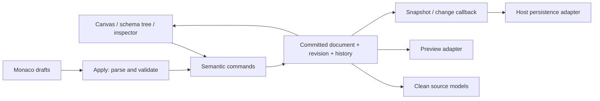

# Architecture and behavior

## 1. Package boundaries

Current package boundaries follow additional-design.md §12. Pure commands remain framework-independent inside the native package; a separate core package can be extracted when another consumer needs it.

```text
apps/jsonforms-svelte-editor-demo/                       # native/WC host, example resources
packages/jsonforms-svelte-editor/src/lib/
  Editor.svelte                                         # native public component
  editor/
    EditorShell.svelte                                  # panel composition
    document/commands/                                  # pure immutable operations
    document/history-store.svelte.ts                    # session and history
    document/identity.ts                                # nonserialized stable identities
    dnd/                                                # svelte-dnd-action zones and drop commands
    registrations/                                      # palette, future authoring descriptors
    components/Canvas/                                  # recursive authoring surface
    components/Inspector/                               # JSON Forms-driven property forms
    components/preview/                                 # runtime web-component adapter
    monaco/                                             # document language schemas
    styles/                                             # editor-specific styles
  # UI imports resolve through the host-owned @jsonforms-svelte-shadcn-ui alias
packages/jsonforms-svelte-editor-webcomponent/src/       # registration and custom-element boundary
  components/ui/                                        # shared host-owned shadcn sources
```

Grow this structure with the document, inspector, theme and i18n submodules described in the additional design as their features are implemented. Workspace splitters use unchanged shadcn/Paneforge components. Resource I/O stays in the demo/host.

Use Svelte 5 runes for reactive presentation state; core commands remain pure TypeScript. The shell uses shadcn-svelte components. Use the existing Svelte JSON Forms binding and shadcn renderers for the inspector. The preview specifically uses the web component. Runtime renderer packages should not acquire a dependency on the editor.

### Host integration contract

The reusable editor is source-agnostic. Its host supplies parsed JSON values; the editor does not open files, fetch URLs, query databases, discover sibling files, or access recovery storage. Source parsing/assembly and persistence belong to the host. Pure bundled/split codecs may be exported as optional helpers, but the editor component must not require their use.

Proposed public API (contract sketch; referenced types are defined during Phase 0):

```ts
type InitialForm = Partial<FormDocument>; // schema, uischema, uischemas, etc.

type EditorInput = {
  documentId: string; // opaque host identity, not a required filename
  initialForm?: InitialForm;
  baseUri?: string; // logical reference identity, never an instruction to fetch
  editorLocale?: string;
  editorMessages?: EditorMessageCatalogs; // host-supplied UI translations
  editorDirection?: "ltr" | "rtl" | "auto";
  editorMode?: "light" | "dark" | "system";
  onDocumentChange?: (event: {
    documentId: string;
    revision: number;
    document: FormDocument;
    origin: "visual" | "source" | "undo" | "redo";
  }) => void;
};

type EditorHandle = {
  getSnapshot(): {
    documentId: string;
    revision: number;
    document: FormDocument;
  };
  replaceDocument(input: EditorInput): ReplacementResult;
  markSaved(documentId: string, revision: number): void;
};
```

For example, a host can pass `initialForm: { schema: loadedSchema, uischema: loadedUiSchema, uischemas: loadedRegistry, config: loadedConfig }`. These values can originate from different sources; the editor receives the same shape in every case. Hosts can also pass an already assembled envelope. No filename, file handle, URL, database client, or serialized bundle is required. Preserve omitted components and explicit JSON values such as `false` and `null` where valid. Copy inputs into owned state and return detached snapshots; never mutate host-owned objects.

Initial values are consumed once per document session. Ordinary host rerenders or echoes of `onDocumentChange` must not reset edits/history. A host awaiting resources should assemble the initial parts before mounting, or explicitly call `replaceDocument` after loading. Replacement is atomic: pending drafts or unsaved committed changes return a `needs-resolution` result until the host resolves them through an explicit discard/apply/save flow. Successful replacement starts a new history/session and baseline; initialization and replacement do not emit a user-edit event. Subsequent visual edits and applied JSON edits emit one complete committed snapshot per transaction, never half-updated parts or invalid source drafts.

The host owns Open/Save/Save As controls, persistence progress, authentication, retries, external version conflicts, and recovery. Save obtains a committed snapshot after draft resolution, writes it through the host's chosen adapter, then calls `markSaved` for that exact document/revision only on success. If newer edits exist, acknowledge the older saved checkpoint while keeping the current document dirty. The editor retains revision snapshots needed for outstanding save acknowledgments; stale acknowledgments for another document are ignored. Failed saves do not advance the checkpoint. A host can omit storage controls entirely and consume changes in memory.

Resource references resolve only against supplied `resources` and logical base URIs. The editor reports unresolved URIs as diagnostics so the host can obtain the missing JSON through its own mechanism and explicitly supply an updated document through the guarded replacement flow. There is no built-in fallback fetch. Monaco schema fetching and preview schema loading must follow the same rule; use supplied schemas/resources rather than silently accessing their URLs. Loading editor assets such as Monaco workers and renderer bundles is separate from obtaining form resources.

The reference app implements local files, bundled/split assembly, downloads, and IndexedDB recovery. Another host can use HTTP, a database API, or embedded imports without modifying the editor. Test the reusable component in a minimal in-memory host without the reference app's file adapters.

### Editor UI internationalization and appearance

Use Svelte 5 and shadcn-svelte for the shell, dialogs, menus, palette, tree, and editor chrome. Reuse the repository's shadcn components and design tokens wherever their public APIs allow; avoid developing a separate visual component system for the editor.

Every editor-owned user-facing string must use a translation key: toolbar/menu actions, palette categories and presets, drop instructions, empty states, confirmations, errors, diagnostic descriptions, tooltips, keyboard announcements, and accessibility labels. Inspector schemas/UI schemas must provide translated labels, descriptions, enum display labels, and validation messages through the JSON Forms translation integration. Preserve diagnostic codes and JSON paths as technical identifiers while translating surrounding text. Do not translate serialized keys, UI element type names, enum values, property names, or user-authored content automatically.

Provide an English default catalog and host-supplied locale catalogs with interpolation and plural handling. Resolve missing messages from the exact locale to its language, then English; avoid showing raw translation keys. The editor does not fetch translation files. Locale changes update the UI without resetting the document, selection, history, or source drafts. Support RTL through direction-aware shadcn components and logical CSS properties; keep JSON source appropriate for code reading. Include a second real locale and RTL/long-text fixtures in verification; the final list of shipped translations can grow without changing the editor API.

`editorLocale` and `editorMessages` configure the editor, including inspector chrome. The form document's `translations` and `preview.locale` configure the authored form and its renderer samples. Changing the editor language must not alter either. Palette/descriptor extensions supply translation keys and catalogs using the same mechanism. Monaco surrounding controls and editor-owned diagnostics use editor translations; any limitation in Monaco's built-in command/menu localization must be documented, with supported locale loading handled at host bootstrap when required.

Support `editorMode: 'light' | 'dark' | 'system'`, defaulting to system. Apply the effective mode to shadcn tokens, canvas chrome, inspector, dialogs/portals, and Monaco. Observe system changes only in system mode and clean up listeners. Scope theme styling to the editor, including its portal container, so embedding it does not change the host application's theme. Persist language/theme preferences only through the host, never through direct editor storage access.

The form's explicit preview mode/design system controls renderer samples and preview independently of editor chrome. If no form preview mode is set, both inherit the effective editor mode. Forward the resolved appearance explicitly across the preview shadow/frame boundary. Changing editor appearance is session configuration, not a form command, and does not mark the document dirty. Test readable focus rings, selection outlines, drop indicators, and diagnostics in both modes.

## 2. One canonical document, two persistence formats

The following is a proposed canonical editor envelope, not an upstream JSON Forms format. The host may supply its individual optional parts through `initialForm`; bundled and split formats below are optional host persistence conventions:

```json
{
  "formatVersion": 1,
  "schema": {
    "$schema": "http://json-schema.org/draft-07/schema#",
    "type": "object",
    "properties": { "name": { "type": "string" } }
  },
  "uischema": {
    "type": "VerticalLayout",
    "elements": [{ "type": "Control", "scope": "#/properties/name" }]
  },
  "uischemas": [],
  "data": {},
  "config": {},
  "translations": {},
  "preview": { "locale": "en", "validationMode": "ValidateAndShow" },
  "resources": {}
}
```

`schema` is the canonical JSON Forms property name. UI labels may say “JSON Schema.” If an imported legacy envelope uses `jsonschema`, offer an explicit migration; do not maintain two competing fields. `schema` may be an object or boolean where its dialect allows it. A new form starts with an object schema and an empty transient authoring container. A missing UI schema stays absent in the document; Preview generates its layout on demand. The first visual insertion creates an explicit UI schema, and subsequent schema edits never regenerate or erase an authored layout.

`uischemas` is the existing ordered registry array, including `tester` and `uischema`; it is not a map of alternate top-level forms. Each entry is individually selectable and editable. Named templates retain `uischema.name`. String testers are preserved as strings. JSON cannot serialize actual functions: reject nonserializable host values at export with a precise diagnostic.

`data` is saved sample data, optional and any JSON value. `preview` stores serializable renderer presentation settings such as locale, readonly, validationMode, mode, theme, designSystem, and customStyle. `resources` maps logical resource URIs (absolute or relative to the host-supplied base URI) to supplied JSON documents for in-memory `$ref` resolution; keys need not be filesystem paths. Unknown envelope keys and all unknown nested keys are preserved. Publish a versioned envelope JSON Schema before building the UI; reject unknown future versions for mutation while permitting source inspection/export of the original bytes.

| Envelope component                                  | Split file                 |
| --------------------------------------------------- | -------------------------- |
| `schema`                                            | `person.schema.json`       |
| `uischema`                                          | `person.uischema.json`     |
| `uischemas`                                         | `person.uischemas.json`    |
| `data`                                              | `person.data.json`         |
| `config`                                            | `person.config.json`       |
| `translations`                                      | `person.translations.json` |
| `preview`                                           | `person.preview.json`      |
| `formatVersion`, `resources`, unknown envelope keys | `person.meta.json`         |

Bundled output is `person.form.json`. `meta.json` contains the remaining top-level envelope keys directly, not a second envelope; reserved component names in meta are an import error. With no meta file, infer version 1. Absent optional components remain absent until created, rather than expanding every import to empty files. For newly created split documents, emit meta to declare the format version. Switching formats preserves semantic values, array order, unknown keys, and optional-field presence. Byte-for-byte formatting preservation after edits is not required; untouched original file bytes may be reused.

In the reference host app, group files by directory and exact basename after removing recognized suffixes; distinguish `uischema` from `uischemas`. If both a bundle and split set exist, show two candidates and require selection rather than silently merging. Duplicate component files or conflicting versions are import diagnostics. Unknown unrelated files are not silently added to the model.

The host can import relative external schema files as resources using their original relative paths. Maintain a virtual base URI per form and resolve `$id` and `$ref` against it. Do not flatten or dereference stored schemas. Bundled-to-split conversion keeps the resource map in meta by default, making conversion deterministic. Materializing resource files separately is an optional explicit export mode that must preserve resource identities and references.

The reference host app must support multi-file selection and downloads in all target browsers; folder access and direct writes are progressive enhancements. Export a split set as a ZIP when directory writing is unavailable. Treat a multi-file save as a planned set of writes: detect external modifications, record partial failures, retain dirty status until all writes succeed, and permit retry. Browser filesystem writes are not inherently atomic. Recovery snapshots belong in IndexedDB and do not replace explicit saves.

## 3. State and synchronization



Keep four distinct state groups:

- Document: committed envelope, revision, saved checkpoint, logical resource identities, reference graph. Physical source provenance stays in the host.
- Session: selection, expanded trees, active category per layout, active registry entry, viewport and panel sizes. Stable node IDs live here, never as injected properties in JSON Forms schemas.
- Drafts: Monaco text, component URI, base revision, parse/validation diagnostics, dirty state.
- Preview: instance data and validation errors, separate from authoring history and saved sample data.

All edits use `dispatch(command, expectedRevision)` and produce one transaction with forward/inverse changes and selection mapping. Commands include AddFieldAndControl, BindControl, InsertLayout, MoveElement, AddCategory, RenameProperty, ChangePropertyType, SetRequired, SetRule, UpdateInspectorFields, ReplaceComponent, and ReplaceDocument. A transaction may touch schema, multiple UI schemas, resources, and sample data; subscribers receive only its complete result.

Maintain stable IDs across command-driven moves and edits. For wholesale JSON replacement, reconcile unambiguous surviving nodes, then select the nearest surviving ancestor if identity is uncertain. Array indexes alone are not identities. Undo/redo restores both document content and usable selection. Dirty state compares to the saved checkpoint, so undoing to it clears dirty status.

### Monaco contract

Provide tabs for Model, Schema, UI Schema, UI Schemas, Data, Config, Translations, Preview settings, Resources, and selected-element JSON. Registry entries/resources can open individual models. Users can dock source beside Design or use a full-source view. Use stable, document-specific Monaco URIs with schemas registered by URI. Load Monaco and workers only in the browser; dispose models, subscriptions, and workers when appropriate.

### Language-agnostic source editor and document-aware tooling

The reusable Monaco wrapper must not hard-code JSON. Each source descriptor declares its language ID, semantic document kind, model URI, schema/tooling associations, serialization/parsing adapter, and validation/completion providers. Language configuration is separate from the editor UI's human language. Hosts or authoring extensions can register additional descriptors/providers without changing the wrapper; this does not promise built-in support for every programming language or alternative form serialization.

JSON Schema remains JSON syntax (`languageId: 'json'`), but its document kind is JSON Schema, not arbitrary JSON. **Schema-aware code completion is mandatory**, including keyword suggestions, allowed keyword values, hover documentation, and structural diagnostics. Associate the schema document with the appropriate JSON Schema meta-schema. Do not validate the schema document against itself: the authored schema instead supplies the schema association for the sample-data editor.

| Source kind                                     | Language and semantic tooling                                                                                                                                  |
| ----------------------------------------------- | -------------------------------------------------------------------------------------------------------------------------------------------------------------- |
| JSON Schema / schema resource                   | JSON plus dialect-appropriate meta-schema, keyword/value completion, documentation, and local reference suggestions                                            |
| UI schema / registry entry                      | JSON plus JSON Forms UI schema definitions extended with installed renderer descriptors; element types, renderer options, and context-correct scope completion |
| Entire model / registry array                   | JSON plus envelope/registry schema; nested schema and UI schema sections retain their semantic tooling                                                         |
| Sample data                                     | JSON validated/completed against the current applied form schema and supplied resources                                                                        |
| Config / translations / preview settings        | JSON plus the applicable configuration schema; generic JSON only for unconstrained extension values                                                            |
| Selected schema or UI fragment / rule condition | JSON with the containing document's semantic context, scope base, and appropriate fragment schema                                                              |
| Template source                                 | Appropriate registered template/HTML language tooling; explicitly identify any unsupported template syntax tooling                                             |
| Tester or validator source string               | JavaScript tooling with declared runtime parameter context where available; source editing never evaluates the code                                            |

Honor a declared `$schema` for tooling where supported and use the configured draft-07 default when absent. Bundle supported meta-schemas and provide host registration for additional schemas/providers. Diagnose unsupported dialect tooling explicitly; do not imply that syntax highlighting proves dialect validation support. Monaco diagnostics support and runtime AJV dialect support are separate capabilities and both belong in the capability matrix.

Use document-scoped URI associations so unrelated open documents do not share schemas or completion candidates accidentally. Completion for `$ref` uses supplied resource identities and escaped pointers; scope completion uses the selected UI/detail/registry context. Update associations and providers when the applied schema, dialect, resources, or renderer descriptors change. Do not alter user-authored `$schema` merely to configure tooling. Disable implicit schema requests and use only bundled or host-supplied schema data. Coordinate language-service registrations across editor instances without overwriting another instance's configuration; dispose only registrations owned by the closing instance.

Non-JSON sub-editors project a string field into its native language and Apply back to that same JSON field through the existing command path, preserving escaping and unrelated fields. Apply validates according to the source descriptor rather than always calling JSON.parse. Whole-document and projected string drafts use the same overlap/conflict rules as component drafts. The canonical form remains JSON; registering a language does not authorize execution or change the stored format.

Visual changes immediately update clean source models, including hidden models when opened. Use guarded edits and preserve cursor/folding where possible; avoid feedback loops. Programmatic synchronization never creates a new application command.

Source is a draft until Apply. Invalid JSON cannot apply and does not damage the last committed canvas. Valid JSON with unresolved references or unsupported elements can apply in repair mode: display diagnostics and placeholders, and withhold invalid preview input. Structural envelope errors cannot apply. Distinguish JSON syntax, dialect/schema validity, UI schema shape, cross-reference diagnostics, and preview data validation.

For the first release, any pending source draft locks visual document mutations across all panels; navigation, selection, preview interaction, and source editing remain available. Before Save, Undo, or Redo, resolve pending drafts with Apply All, Revert, or Cancel. A view switch retains the draft and visibly shows that Design represents the last applied revision. Do not silently discard it or pretend it has applied.

Allow multiple disjoint component drafts to Apply All as one candidate document. Whole-model and component drafts overlap, as do a selected-node draft and its component: prevent opening a second editable overlapping draft until the first is resolved. Revision mismatch blocks Apply and offers comparison/reload, never last-writer-wins. Monaco text undo operates inside a draft; committed application undo is separate and clearly labeled.

## 4. Canvas and layout authoring

The authoring canvas is an editor-owned UI schema traversal with selection outlines, handles, placeholders, and drop zones. It must not rely on injecting handles into the web component's shadow DOM. Controls must visually match their actual shadcn runtime renderers as closely as practical: use the same typography, spacing, labels, required markers, descriptions, icons, borders, option-dependent variants, and form design-system settings. Rules must not hide authoring nodes or disable editor actions.

### Renderer appearance and authoring interaction

Prefer reusing the actual renderer or its shared presentation components inside an editor-owned selection wrapper. Resolve the same renderer tester/options as Preview. Where direct runtime reuse prevents reliable selection or has side effects, supply a descriptor-specific design adapter that reuses those presentation components. Extract a shared presentation component only when necessary; avoid approximate generic boxes for supported controls. Descriptor contracts must include a design presentation strategy and any intentional differences from runtime.

In Design, a text input or textarea looks like the real field, but clicking selects its UI node and typing does not change form data. Prevent runtime focus, value changes, dropdown/calendar opening, uploads, button actions, and other runtime side effects through a suitable adapter or inert runtime subtree with an accessible editor wrapper. Merely applying `pointer-events: none` is insufficient because keyboard interaction can remain active. Do not set every control disabled just to intercept interaction: that changes opacity and styling away from its normal appearance. Model actual disabled/readonly states visually when requested, while keeping the editor wrapper selectable.

Use design-only representative values where necessary to make a renderer recognizable; keep them outside the document and preview data stores. Inspector changes such as multiline, format, label, description, required status, or variant immediately update the design presentation. Authoring controls remain active: tabs/steps switch editable containers, layout handles move elements, and explicit editing affordances modify labels/properties through commands. This is distinct from interacting with a form field's runtime value. Full data entry and renderer behavior belong in Preview.

For complex renderers (arrays, grids, file inputs, templates, or embedded Monaco), provide a faithful static surface plus explicit nested-authoring entry points where live runtime behavior would obstruct editing. Unknown renderers retain the placeholder fallback. Show intentional deviations, such as otherwise hidden elements, through editor badges/outlines rather than altering the saved UI schema. Compare design and preview under the same form locale, schema, UI options, and appearance settings in visual regression fixtures.

| Layout/element                 | Required visual behavior                                                                            |
| ------------------------------ | --------------------------------------------------------------------------------------------------- |
| VerticalLayout                 | Ordered children; before/between/after and empty-container drop targets                             |
| HorizontalLayout               | Horizontal insertion, nested layouts, responsive authoring outline                                  |
| Group                          | Label editing and full child editing                                                                |
| Categorization + Category      | Add/select/rename/reorder/delete tabs; drop into every category, including empty tabs               |
| Categorization stepper variant | Same category operations with step presentation; serialize `options.variant: "stepper"`             |
| Array/object Control           | Select schema binding; enter nested/detail UI schema editing with correct scope context             |
| Split variant                  | Edit horizontal/vertical container and splitter options; serialize existing layout type and variant |
| TemplateLayout                 | Edit template source and named children with visible child/slot drop targets                        |
| Template / Slot                | Choose named registry template, edit overrides/default children, navigate to definition             |
| Label and supported controls   | Select/move/edit through descriptor-driven inspectors                                               |
| Unknown extension element      | Preserve JSON, select/move where safe, show placeholder and raw properties                          |

Standard JSON Forms provides VerticalLayout, HorizontalLayout, Group, and Categorization; Category is its child structure. See [upstream layout documentation](https://jsonforms.io/docs/uischema/layouts/). Repository variants are additional capabilities, not invented JSON Forms layout types.

Categorization accepts Category nodes, while Category accepts controls/layouts. Starting a categorization creates one empty labeled category. Dropping a field on its tab targets that category's contents. Hovering a tab during drag activates it without committing a document change; keyboard “Move to…” offers the same operation. Support tab overflow, nesting where the runtime supports it, and disabled/hidden-rule badges. Removing a tab removes its UI subtree, not its schema properties. The last tab can be removed: show an empty categorization authoring placeholder and a preview diagnostic until a tab is added.

Drag payloads distinguish existing schema field, new field preset, existing UI node, and new layout. Validate target context before drop, prohibit cycles and incompatible children, and perform a move atomically. Provide insertion indicators, Escape cancellation, auto-scroll, and keyboard add/move actions with accessible announcements. Select a drag library only after a small nested-container/tabs/keyboard spike against the installed Svelte version; keep the command model independent of that choice.

Deleting a control only removes its UI occurrence. Duplicating it defaults to another binding to the same schema property; “Duplicate with new field” explicitly clones the definition with a unique name. Layout duplication preserves bindings. Removing schema data is a separate operation with a reference-impact preview.

## 5. JSON Schema authoring and references

The schema tree shows properties, objects, arrays/items, required status, referenced definitions, and combinator branches. It supports selection and visual add/rename/delete/type/constraint editing even when a property has no UI control. Existing fields can be used more than once, with usage counts and navigation to occurrences.

New control presets specify both a schema fragment and UI options. Initial presets: text, textarea, integer, number, checkbox, enum select, enum radio, date, time, date-time, object, and array. Extension presets follow actual renderer testers and option contracts. A textarea creates a string plus `options.multi: true`; a text input creates a string with multiline disabled/absent. Do not serialize “TextArea” as a new UI schema type: both are Controls.

A layout is not a schema object scope. When adding a new field, explicitly determine its target object from the selected schema context; default to the root object only when unambiguous. In an array detail editor, default to its item object. If there are multiple branches or no suitable object, prompt for a target or offer creation of one. Generate collision-free property keys and editable labels separately.

Use parsed, escaped JSON Pointer segments (`~0`, `~1`) and resolved resource identities; never string-replace property names. Track scope context for the main UI schema, each registry entry, nested `options.detail`, arrays, and references. A detail scope can be relative to its item schema rather than the root document.

RenameProperty must update the parent's properties key and required list, all statically resolved affected control and rule scopes, local `$ref` pointers, schema keyword references such as dependentRequired/dependencies when supported, and nested detail/registry scopes. Update exact known references only; do not rewrite unrelated labels or string constants. Include known rule condition schema property references when their data context is resolvable. Arbitrary tester code, template text, custom keywords, and externally owned resources may contain references that cannot be safely rewritten: flag those occurrences for manual review before committing the rename. Offer an explicit sample-data migration; do not silently rewrite active preview data.

Deletion shows affected controls, rules, references, and sample data; offer cancel, delete with affected UI occurrences, or leave broken bindings for repair. Type changes show incompatible keywords/options and propose exact removals; retain unrelated/custom fields and do not coerce sample data automatically. Required is a key in the owning object's required array, not a boolean on the property definition.

For `$ref`, distinguish “edit shared definition” from “create local copy.” Editing the shared definition shows all consumers. Cycles remain navigable through bounded expansion. Resource resolution uses host-supplied JSON in memory. Missing resources produce diagnostics; any import/fetch action is implemented by the host and never by the reusable editor.

Initial visual schema coverage includes object properties/required, array items and item constraints, strings/formats/length/pattern, numeric bounds/multipleOf, enums/const/default, booleans/null, and title/description. Add definition and combinator navigation plus branch editing in the advanced phase. Preserve all other keywords and allow Monaco editing. Do not claim arbitrary JSON Schema equivalence or full visual coverage of every dialect.

## 6. JSON Forms-driven inspector

An authoring descriptor provides palette metadata, matching logic, creation defaults, child-slot rules, inspector JSON Schema/UI schema, projection from the document, and command-producing updates. Renderer testers select runtime rendering; editor descriptors separately define how a matching element can be authored. Use explicit priority and a raw-JSON fallback for unknown matches.

The inspector renders an editor-specific projection through JSON Forms:

```text
identity: propertyName, title, description, scope
schema: type, required, format, default, enum, constraints
presentation: label, options (including multi), renderer variant
layout: label, orientation/variant, child configuration
rule: effect, condition scope, schema, failWhenUndefined
advanced: remaining schema keywords and UI extension properties
```

Projection fields are not persisted as an invented intermediate schema. A descriptor translates changed fields into semantic commands against the real JSON Schema and UI schema. Patch changed paths only; spreading the entire inspector value back into the selected node would erase unknown properties and confuse schema/UI fields. Guard initialization events and revision/selection changes so JSON Forms callbacks do not create accidental edits.

Use JSON Forms groups/categories and visibility rules to show appropriate controls. Custom inspector renderers can provide schema-path picking, enum editing, constraint lists, and Monaco for arbitrary JSON. Text drafts may wait for blur/Enter; destructive structural changes use an explicit impact confirmation. Coalesce ordinary typing into useful undo entries. Keep a selected-node source pane available, and support schema-only selection independently of UI selection.

## 7. Rules

Support SHOW, HIDE, ENABLE, and DISABLE, a schema-scope picker, JSON Schema condition, and `failWhenUndefined`. The visual condition builder initially covers equality/const, enum membership, numeric comparisons, string patterns, existence, and allOf/anyOf/not composition. Serialize to real JSON Forms rules, with no parallel proprietary expression format. See [JSON Forms rule semantics](https://jsonforms.io/docs/uischema/rules), including undefined values.

An existence predicate must check `required` in its parent-object scope, with undefined handling tested explicitly. Complex conditions are preserved and labeled “Advanced JSON”; opening or closing the visual inspector must not simplify or overwrite them. Attach rules to controls and layouts/categories where accepted by the runtime. Show badges and condition results against preview data in Design; enforce actual effects only in Preview.

The repository also accepts code strings for registry testers and rule validators. These are not standard schema conditions and must remain identifiable. Imported source is never executed by the authoring canvas. Preview of executable extensions needs an explicit trust/isolation policy: use a sandboxed preview frame on an isolated origin (without editor storage/credentials), or disable those entries until the user explicitly enables trusted execution. Do not pass imported strings directly into the existing `new Function` transformation in the editor page. This requirement follows the concrete implementation in `core/uischemas.ts`, not a hypothetical capability.

## 8. Reusable UI schemas and templates

Provide a registry navigator with add/remove/reorder, name, tester source, and a canvas for each entry's UI schema. Preserve registry order because ranking/ties can matter. Expose the active schema context for editing an entry and allow selecting an example binding context when a tester could match multiple schemas.

Template references select registry names; inspect definitions and instance overrides separately. Slot drop targets edit the owning default or override explicitly. Rename a template/slot through an impact-aware command. Detect missing names and recursive template expansion; render an authoring placeholder instead of recursing indefinitely. Template source stays in Monaco with named-child editing; arbitrary HTML/CSS is not promised as a pixel-level visual page builder.

## 9. Preview integration

Load the built local custom element bundle, including its chunks/assets, client-side. Wait for registration and assign new object values to JavaScript properties: schema, uischema, uischemas, config, data, translations, and supported preview settings. Resolve host-supplied schema resources in an in-memory preview adapter without modifying serialized source or performing resource I/O; verify the component's AJV/resource behavior in the integration spike and add the smallest necessary resource-registration API if needed. Never claim external `$ref` preview works merely because the document resolver can find it.

Listen only to the component's CustomEvent `change`, reading `detail.data` and `detail.errors`; native change events can also bubble. Keep preview data in its own store, prevent echo loops, and offer Reset to sample, Clear, and Use current data as saved sample. Provide data/error Monaco tabs, viewport sizes, locale/theme/readonly controls, and a visible stale-preview state when the current document cannot render. Schema edits retain preview data and report new validation errors rather than silently deleting values.

`handle-action` is an inspectable preview event, not permission to perform application network actions. Runtime validation and rule behavior come from the actual renderer. Use isolation from the previous section when executable content is enabled. Preview configuration belongs in the document only when explicitly saved; temporary viewport/tab navigation remains session state.

## 10. Optional preview and data panels

Provide independent, accessible Show/Hide controls for **Preview**, **Form Input**, and **Form Output**, available from a workspace View menu even when all three panels are hidden. Provide a Designer focus action that hides all three together, and a Restore workspace action that reinstates their previous visibility and sizes. Hidden panels leave no reserved blank area; the designer expands into the available space. Users can also resize visible panels.

Form Input places its localized Apply/Revert icon buttons with tooltips in the panel header. Form Input and Form Output use equal-height headers so their Monaco editors align without an extra input toolbar.

Form Input is the editable runtime input/sample-data source pane described in the preview contract. Applying input supplies preview instance data; promoting it to saved sample data remains explicit. Form Output is a read-only view of the latest runtime output data and validation errors received from the web component. The canonical Data source tab continues to edit the saved sample-data component through document commands. Label these roles clearly so editing preview input is not mistaken for modifying saved form data.

Visibility is independent: users may keep data panels visible while hiding the visual preview, or show Preview alone. Hiding a panel preserves its Monaco draft, cursor/view state, data, errors, and current authoring selection; it does not reset the renderer or apply/discard pending input. Keep runtime evaluation available when a visible output panel depends on a hidden preview. If all preview-related panels are hidden, expensive rendering may be suspended while preserving state; on restoration, synchronize to the current committed document and retained runtime data before presenting output as current. Clearly identify stale output while evaluation is pending.

Expose initial panel visibility as optional host UI configuration and emit workspace preference changes for host persistence. Do not persist visibility in the form envelope or mark the document dirty. Changing visibility must not trigger form change callbacks. When hiding a panel containing focus, move focus to its visibility toggle or another predictable workspace control. Restored editors must resize to their actual container dimensions.

## 11. Expanded design requirements

The [additional design](./additional-design.md) is part of the implementation handoff. Follow its [integration decisions and phase mapping](./design-integration.md) for configurable dialects, non-object roots, definitions/ref actions, dynamic-keyed objects, complete schema-tree authoring, and English/Bulgarian localization. The integration page records the confirmed explicit Apply/Revert policy and the native-library/web-component package split and preserves confirmed host-I/O, canvas fidelity, preview, and panel-visibility requirements.

## Native inspector and shared shadcn components

The property inspector must render native `JsonForms` from `@chobantonov/jsonforms-svelte` with `@chobantonov/jsonforms-svelte-shadcn` renderers/cells. It must not use the renderer web component. Inspector controls live within the editor's DOM/theme boundary, including its shadow root when embedded as a web component; popup portals must remain in that boundary.

Both the editor UI and the native shadcn JSON Forms renderers resolve `@jsonforms-svelte-shadcn-ui` through the consuming host's Vite alias. The current shared source set lives in `packages/jsonforms-svelte-editor-webcomponent/src/components/ui`, copied unchanged from the repository's shadcn set. The demo deliberately maps to that same directory. A demo/application may instead provide its own shadcn source directory by changing the alias. It must apply that mapping to both editor and renderer imports and include those sources in Tailwind scanning.

The reusable native editor must not carry a second private shadcn component set or prebundle inspector components that bypass this alias. Changes to a host's shadcn component affect every use of that component in the editor and inspector after rebuilding the consuming host. Theme tokens are shared too. Component customizations must be disclosed to the owner; baseline copies remain byte-for-byte unchanged in this increment.

Actual form preview continues using the existing shadcn renderer web component. Its separate distribution is not automatically restyled by an inspector/editor host component change.

## UI component policy

Interactive UI is shadcn-first throughout the editor and demo. Use the host-shared shadcn component even when a raw HTML control seems simpler. Raw interactive elements are permitted only as rare, explicitly explained and documented exceptions; inform the owner before introducing them. Semantic HTML for structure and DOM generated internally by shadcn/Monaco are expected. See the [confirmed component policy](./design-integration.md#owner-requirement-shadcn-first-ui).

## Expandable schema tree and empty-demo flow

The schema view renders hierarchical ARIA tree items with expandable object properties and array item structure, type badges, keyboard navigation and stable schema-pointer identities. Expansion/focus are presentation state. Object and array properties are independently draggable: a drop binds one `Control` at the container’s own scope without splitting it into leaves or modifying its schema. Renderers decide how to display that container. Array-item descendants are visible for navigation but require a future detail-layout editing context; bind the array itself on the current canvas.

Source document selection uses the shared shadcn Select, with its popup portalled inside the editor root so theme tokens and shadow-root styles apply. Canvas and palette buttons use the shared Button; the demo uses shadcn NativeSelect wrappers. No hand-written button/select/input/textarea remains in the editor implementation. ARIA tree containers and library drag handles are semantic interaction infrastructure; their visible actions use shadcn primitives.

The demo opens on **New form (blank)**. Neither integration supplies `initialForm` for this choice; the editor initializes its own empty schema and root layout. Examples remain opt-in. The host’s New form action creates a fresh session, prompting before discarding committed edits or unapplied drafts. Starting new or switching integrations is host state, not a document command or renderer resource-fetch operation.

### Designer workspace panel arrangement

The workspace positions the palette/schema tree on the left, designer in the center, preview beside
it, and inspector on the right. Preview is initially open. Model JSON and Form
Input open below the designer; Form Output opens below preview. Shadcn/Paneforge
splitters resize both columns and the lower panels. Collapsing preview leaves a
restore rail and returns its space to the designer. Lower panels have Collapse
actions and status-bar toggles; Model and Preview remain accessible in thetoolbar.

Panels remain mounted while collapsed, preserving Monaco drafts and runtime
values. Model JSON retains its document selector and explicit Apply/Revert;
hiding an unapplied model draft does not unlock visual mutations. Form Input is
separate preview sample data with Apply input/Revert input. Applying it resets the
preview data without authoring a model change. Form Output is a read-only Monaco
view of current preview values. Loading another document resets this workspace
state. Source/model data changes refresh the preview sample. No shadcn source
components are modified for this layout.

The preview runtime instance is recreated when schema/UI structure changes, since
reusing its internal control state across removed/restored layout subtrees can
leave stale renderer bindings. Preview data lives outside that instance; ordinary
input changes and panel collapse do not recreate it.

### Application prompts

Use shared shadcn dialogs for application confirmations and requests for input;
do not use `window.confirm`, `window.prompt`, or `window.alert`. The demo uses a
themed dialog for discarding work on New Form, example changes, and integration
changes. Cancel, Escape, and close preserve the current form and selections.
The browser-owned page-close/reload `beforeunload` safeguard is the platform
exception: browsers do not allow substituting an asynchronous custom dialog there.

### Current workspace views and host commands

This supersedes the earlier panel defaults. Design is the default view, with
Components/schema tree, Form Definition, and inspector; preview/input/output are
hidden. Validate opens Form Definition, Form Preview, Form Input, and Form Output.
JSON Model replaces the entire visual workspace, including palette and inspector,
with the full-width source editor. View buttons sit at the bottom, JSON Model on
the left and Design/Validate on the right. Drafts survive switching views and
continue to lock visual changes until Apply/Revert. Panel collapse actions use
icons with accessible names. Form Definition uses the shared panel heading.

The native Editor exposes `undo()` and `redo()` and an `onhistory` callback with
`{ canUndo, canRedo }`. The web component exposes the same methods and emits
`history-change` with that state. Host controls must honor this state, which
includes draft locking. The demo owns Undo/Redo buttons; the reusable editor has
no toptoolbar. Other hosts can connect menus or commands to the same interface.

Components are grouped into Inputs, Selection, Presentation, Actions, and
Containers. Presentation includes JSON Forms Label (`text`); Actions includes the
extended Button (`label`, `action`). The native JSON Forms inspector edits label
text and button action names. Authoring samples are inert. Design samples use
`ValidateAndHide`, retaining required markers without empty-data error styling;
Validate preview uses `ValidateAndShow`. Delete controls appear only for selected
elements, including tabs; hover or keyboard focus alone does not reveal them.

### Inspector sections and supported properties

The inspector uses the native JSON Forms Group renderer with the shared
[Group options](../group-options.md). General starts expanded; Schema, Appearance,
Validation, and Layout start collapsed. Each section can show its data indicator
in either state. Unset inspector defaults are omitted from the projected data so
an unchecked, unauthored setting does not activate the dot.

`editor/inspector/definition.ts` describes applicable fields and groups;
`inspector/fields.ts` maps schema keywords and UI options. Changes are applied
through document commands, preserving unrelated schema keywords and UI options.
Invalid inspector values are not committed. Initial supported properties are:

| Element | Inspector properties |
| --- | --- |
| Control | Label; schema title/description; read-only; required for named properties |
| String control | Multiline; minimum/maximum length, pattern, format |
| Number/integer control | Minimum, maximum, multipleOf |
| Array control | Minimum/maximum items, uniqueItems |
| Object control | Minimum/maximum properties |
| Group | Label; collapsible, initially collapsed, show data indicator |
| Category | Label |
| Label | Text |
| Button | Label, action name |
| VerticalLayout, HorizontalLayout, Categorization | No unsupported label field; use JSON Model for advanced options and rules |

Multiline is not exposed or changed for boolean/number controls. General JSON
Schema structural editing (renames, type changes, refs/combinators), rules, and
renderer-specific options beyond this table remain separate authoring increments.

### Toggle navigation, source actions, and translation authoring

JSON Model is a shadcn Toggle: activating it opens the full source workspace;
activating it again returns to the remembered Design or Validate preset. The
visual preset uses a single shadcn ToggleGroup and always retains one selection.
Choosing either preset exits JSON Model. Drafts and draft locks survive toggling.
Apply/Revert remain explicit, above Monaco beside the document selector, as icon
buttons with accessible names and themed shadcn tooltips. Shadcn sources are
unchanged.

`editorLocale` controls editor UI text; `formLocale` independently controls sample
and preview translation. Both default to `en`. `editorMessages` accepts
`{ [locale]: { [EnglishMessage]: translatedMessage } }` for host overrides. Lookup
uses the exact locale, its base language, the built-in catalog, then English.
English fallback and an initial Bulgarian catalog cover navigation, source
commands, panel headings, and inspector fields; remaining messages currently fall
back to English. This is separate from the authored form's `translations` part.
The demo controls Editor language; the preview header controls Form language.

The JSON Forms-driven Translations inspector section supports explicit UI-schema
`i18n` prefixes and label/text translations; Controls also offer descriptions.
Catalogs use the existing nested format: `translations[locale][prefix].label`,
`.description`, or `.text` for Label elements. A translation key must be present
before entering values. The inspector displays translation fields for every declared form language. Namespace changes preserve old entries and load the newly selected
namespace; they do not silently migrate or overwrite translations. Empty values
remove only that locale/key's leaf, preserving other entries. These document edits
use normal history and source synchronization. The Translations section does not use a data dot.

Native Editor and its web component accept `editorLocale`, `formLocale`, and
`editorMessages` (web-component attributes: `editor-locale`, `form-locale`; message
catalogs are passed as an object property). Form resource loading remains the
host's responsibility.

In Validate view, collapsing Form input or Form output keeps a full-width header
with an expand icon below its column. Expanding restores the previous pane size
and mounted editor contents; reselecting Validate is not required. These headers
are absent in Design view. Expand actions use the editor message catalog.

### Schema-tree selection and unused-field filtering

The header's shadcn checkbox **Show unused fields only** is off by default and is
local presentation state. Usage means an exact Control scope in the active
`uischema`, including inactive category tabs. Other registered UI schemas and
rule conditions do not count as placements. The filter recomputes after edits,
deletions, undo/redo and JSON Apply. Used ancestors remain as non-draggable context
when they contain unused descendants; binding an object does not mark each child
as individually placed. Array item details still require their own editing context.

Click or Enter selects a schema field without inserting it or creating history.
Drag-and-drop is the tree's insertion gesture. An unplaced field shows a clear
inspector message and can currently be edited through JSON Model; it does not
show an unrelated control's inspector. A placed field selects its existing UI
control and reveals its category tab. For multiple placements, retain the current
matching selection, otherwise select the first in document order. A shadcn
**Control placement** chooser in the inspector lists distinct layout paths with
sibling positions. It is also available when selecting a duplicate on the canvas.
Schema edits affect the shared field; UI options such as `multi` affect only the
selected placement. Choosing an occurrence never changes the document.

### Presentation and selection palette

Presentation includes Label, Separator, Spacer and Image View (`ImageView` in
JSON). See [presentation renderer options](../presentation-renderers.md). The
native JSON Forms inspector exposes spacer height and image URL/alternative
text. No data fields are created by presentation presets.

Selection includes Checkbox, Checkbox group, Radio group and Select. The latter
three reuse existing renderer testers: scalar enum/oneOf for dropdowns,
`options.format: "radio"` for radio groups, and an array with `uniqueItems: true`
and enum/oneOf items for checkbox groups. The Choices inspector edits values,
switches enum/oneOf, and allows scalar dropdown/radio switching. oneOf exposes
separate display titles; enum has values only. Converting to enum intentionally
removes oneOf titles/branch metadata; undo restores the previous model. Existing
oneOf metadata is preserved for retained values while editing within oneOf.
Values retain their existing homogeneous string/number/boolean type. Complex or
mixed-value schemas remain available in JSON Model rather than being flattened.
Multiline is not offered for selection controls. UI display is per placement;
choice values modify the shared schema. Removing/changing choices does not
silently rewrite preview data: validation reports values no longer allowed.

Choice lists use native JSON Forms array editing in the inspector. Commands
reject empty lists, duplicate values and incompatible value types; changes use
normal document history and source synchronization. Monaco recognizes the new
presentation types and options. Generated selection presets begin with two
string choices; checkbox groups use an array of those strings.

The inspector recreates its native JSON Forms instance when its property schema
structure changes (for example, switching enum values to oneOf values plus
titles). This prevents array/table cells from retaining obsolete column schemas.
The edited document and undo history stay intact; local inspector section
expansion returns to its default for the new structure.

Canvas renderer samples, like live preview, are recreated when the schema/UI
structure changes. This is necessary when changing renderer families (for
example enum dropdown to oneOf dropdown) so an old control does not receive an
incompatible schema during dispatch. Selection and document history remain in
the editor session, outside the sample lifecycle.

Form language selection belongs to the Form preview header, not the demo
toolbar. Its shadcn selector appears only for object catalogs (including empty catalogs) in the
form's `translations` map, and lists their locale keys (including custom locale
codes). The selected locale is local session state, used by preview and design
samples; it does not alter form data or history. The host `formLocale` remains
an initial/external preference. If that locale is unavailable, use the first
available catalog; without catalogs, retain the host preference and hide the
selector. Adding/removing catalogs updates the list immediately. Editor UI
language remains independently controlled by the host.

The proposed next horizontal-layout enhancement is documented in
[Horizontal layout sizing](../horizontal-layout-sizing.md): per-placement
`options.columns` (Auto or 2–16), shared sizing across the canvas and renderer
sets, with fixed fractions of the entire row rather than normalized weights.
This proposal is not implemented by the current equal-width layout renderers.


### Declaring languages and editing all translations

Form language support is declared by locale-keyed object catalogs in
`translations`, including empty objects. There is no second locale list to keep
synchronized. The Properties panel provides an Add form language shadcn dialog,
available even when the selected layout has no translatable label. It validates
and canonicalizes language tags, rejects case-insensitive duplicates, and creates
an empty catalog without changing other catalogs. This is one undoable document
operation and is disabled while a source draft is pending.

The JSON Forms-driven Translations section shows the translation key plus
label/text and (for Controls) description fields for every declared language at
once, identified by locale code. The previous single-locale textbox is removed.
Adding a language rebuilds these fields and updates the preview selector, even
before its first translated value is authored. Translation values remain nested
under each locale's existing key namespace. Clearing a value removes that leaf
but retains the language declaration. Key changes do not migrate old translations.

### Canvas selection and panel heading conventions

Clicking a component's frame, heading, or rendered sample selects that component
and displays its properties. Nested components stop click propagation so their
parent layout does not replace the selection. Keyboard users can activate the
existing selection buttons; focus alone is distinct from selection.

Use title case for English workspace panel headings: **Form Definition**,
**Form Preview**, **Form Input**, and **Form Output**. This is a consistency
convention, not a requirement to capitalize every UI label. Translations follow
the capitalization conventions of their language.

### Visual schema-tree authoring

Object nodes expose Add; properties and definitions expose Rename and Delete.
These actions use shadcn dialogs and one undoable document transaction. Arrays
can be created with primitive, object, or definition-reference items. Expand an
object array's `items` node to add its fields. The array itself remains draggable;
item fields require an array-detail canvas and are not draggable on the root canvas.

The root exposes Add definition. New definitions use `definitions` for the
existing draft-07/default workflow and `$defs` when `$schema` declares 2019-09 or
2020-12. Both existing dictionaries appear in the tree. Definitions are schema
resources, not data fields: create a property using the definition from the type
selector, then drag that property to the canvas. Reference targets are preserved
as `$ref`, never expanded into duplicate schema objects. This follows the
[JSON Schema modular structure](https://json-schema.org/understanding-json-schema/structuring).
No resources are fetched by the editor. This does not change preview-validator
dialect support.

Rename updates local pointer references, UI scopes (including registered UI
schemas), required/dependency names, and sample data at property/object-array
locations, including local definition references. Delete removes an unused schema
and corresponding sample data after confirmation. A referenced deletion is
rejected with a dialog message; remove controls/rules/reference properties first.
Duplicate names and sample-data collisions are rejected atomically. Source drafts
lock all schema actions. Embedded `$id` resource refactoring is reserved for JSON
Model; cross-resource/anchor references and array-detail UI-relative scopes need
an explicit resolver/refactoring contract before visual refactoring is supported.

The Components, Schema tree and Properties panes use the shared shadcn
`ScrollArea.Root` with `type="auto"` and both orientations. The pane shell has
`overflow: hidden`; the ScrollArea viewport owns scrolling and provides themed
scrollbars only where content overflows. Prefer this component for ordinary
scrollable editor panes. Monaco retains its own scrolling implementation.
Shared shadcn component sources are unchanged.
The editor CSS imports `shadcn-svelte/tailwind.css` for the upstream state and
orientation variants (including `data-vertical` and `data-horizontal`). These
variants are required for the shared scrollbar's dimensions; importing only
Tailwind itself is insufficient. The native editor declares the stylesheet
package as a dependency so both host integrations resolve it consistently.
Shadow-DOM integration exception: Bits UI's viewport CSS is normally emitted as
page CSS. The editor stylesheet repeats its native-scrollbar hiding and viewport
flex-layout rules, scoped under `.editor`, so they are present inside the custom
element's shadow root as well. Keep these rules aligned with the installed
`bits-ui` `scroll-area-viewport.svelte` during upgrades. This is host stylesheet
integration, not a modification to the shared shadcn component sources.

Dialog and popover portal targets must use a reactive editor-root element reference. This allows portals mounted before the root binding is ready to receive the actual themed container, instead of falling back to the page body and losing theme tokens (or escaping the web component shadow root).

Collapsing Form Preview hides all runtime panes: Preview, Form Input, and Form Output, including the input expand header. Reopening Preview restores each data pane’s previous expanded/collapsed state and preserves input drafts.

Form language management is a translated language icon with a tooltip in the Form Definition header, outside the selected-element Properties pane. Its dialog lists the current languages and allows adding a language. Properties contains neither move nor remove layout actions; those belong to Form Definition.

Omitting `uischema` is supported and preserved by Apply, history, and serialization. Preview passes the missing UI schema to JSON Forms for automatic generation. Form Definition never displays those generated controls: a transient empty authoring container allows the first visual insertion to create an explicit UI schema. The transient container is not exported.

Schema authoring supports a single JSON Schema type or a union such as `["string", "number"]`. Add Property offers a primary type and optional additional types; Properties offers a JSON Forms-driven Types selection, including for unplaced schema fields. One selected type serializes as a string; multiple selected types serialize as an array. Type changes preserve unrelated schema keywords and remove the multiline UI option when string is no longer allowed. Renderer selection follows its normal tester ranking; a type union does not guarantee a specialized renderer for every combination.

## Rules inspector design

The proposed [Rules editor and canvas indicator](./rule-editor.md) defines a dedicated collapsible JSON Forms-driven Properties section, explicit Apply/Revert rule drafts, and a persistent branch icon on UI elements that own a rule. The required asterisk remains reserved for required fields. Rules belong to UI occurrences; unplaced schema fields do not expose this section. The initial rule builder is implemented; the linked document distinguishes delivered behavior from advanced follow-up work.

The Rules design targets all six effects in the installed JSON Forms 3.8.0, including READONLY and WRITABLE. Editor-specific native Svelte renderers register through `editor/inspector/renderers/index.ts` and are composed with shared shadcn renderers for the Properties JsonForms instance; see the [inspector custom renderer registry](./rule-editor.md#inspector-custom-renderer-registry). This registry is used by the implemented Rules inspector renderer.

The inspector registry includes `SchemaTypeRenderer`, selected by `options.editorControl: "schema-type"`. It uses shared shadcn Select components with a multiple selection for array-valued inspector fields and a single selection for string-valued fields. `options.multiple: false` also restricts an array-valued projection to one choice. The Types field uses the array projection; document commands serialize one selected type as a string and several as a union array. Empty selection is rejected, and the widget respects visibility, read-only state and JSON Forms change dispatch.

For a type-selector field whose own schema permits both string and array values (`type: ["string", "array"]`), the renderer emits a string for one selected type and an array for multiple types directly. Array-only projection fields retain arrays for the document command layer to serialize.

Example inspector UI schema registration usage:

```json
{
  "type": "Control",
  "scope": "#/properties/type",
  "options": { "editorControl": "schema-type", "multiple": true }
}
```

Use a corresponding inspector data schema of `type: ["string", "array"]` for direct JSON Schema type values, or `type: "array"` for the editor's `schemaTypes` projection. Use `multiple: false` when only one type is permitted.

Inspector changes preserve the values emitted by JSON Forms: no empty-string or false defaults are injected. Exposed fields removed from the emitted data are passed as explicit undefined deletions; fields not exposed by the inspector are left untouched. Explicit empty strings and false values remain authored values. Structural projections (such as required membership) still map to their JSON Schema representation.
